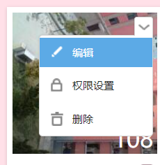
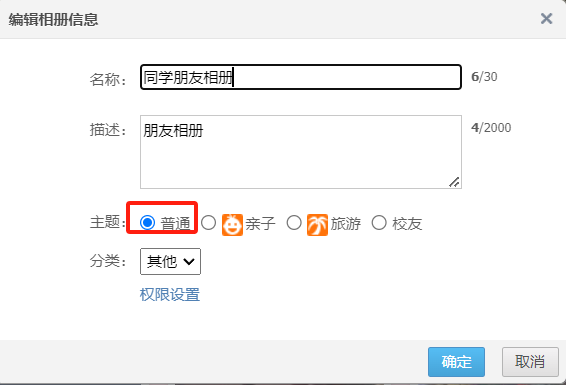

这是一个谷歌浏览器插件，专门用于查看QQ空间相册所有照片并进行批量下载的

使用流程
1. 下载download-picture.rar
2. 解压download-picture.rar：在chrome浏览器中打开扩展程序，勾选开发者模式，点击加载已解压的扩展程序，选择解压后的文件夹
3. 打开QQ空间，点击相册（目前只支持普通主题的相册）
如果相册不是普通主题的话，可按照下方图片操作修改相册主题

4. 点击相册，进入相册页面后，点击插件图标，在弹窗页面中，点击查看当前相册的所有照片

5. 然后在新的页面中，会展示当前相册一共有多少照片，有个下载所有照片的按钮，点击后就会把所有照片打包成一个“相册图片.zip”文件，下载到本地
